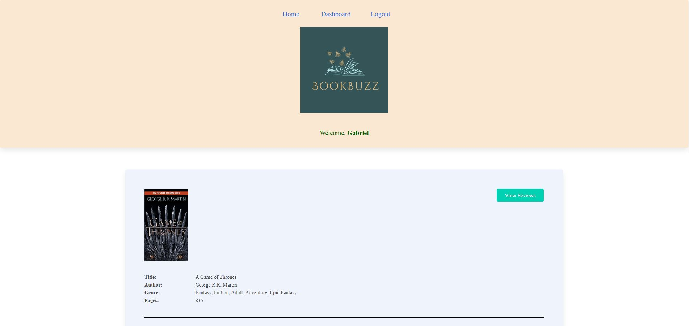

# Book Buzz

## Description
  
  
Book Buzz is an application for readers to give review for well known books.  Readers will create a protected login account with username and password to get full access to the application. Then a list of books will be provided for users to leave a review.  Readers are also able to browse the application to see all reviews of the books provided on the site.  When finished, users are able to log out.

Our motivation for building this project was to get experience with developing a full-stack application in a group setting.  We built this project so that we could learn how to develop back-end routes, front-end handlebars views, and regular javascript all at once.  This project solves the problem of a user needing a free website to submit book reviews on for other people to view.  In this project, we learned how to resolve GitHub merge conflicts, and how to successfully collaborate with each other to build a significant application.

## Table of Contents 
  
- [Description](#description)
- [Installation](#installation)
- [Usage](#usage)
- [Credits](#credits)
- [License](#license)
- [Contributing](#contributing)
- [Features](#features)
- [Tests](#tests)
- [Questions](#questions)

## Installation

This application is live on Heroku.  To use it, please use the link in the **Usage** section

## Usage

To use our live application, please use the following link to Heroku: (https://aqueous-plateau-25751-d19cd5ff4a3b.herokuapp.com/)[https://aqueous-plateau-25751-d19cd5ff4a3b.herokuapp.com/].

Here is a screenshot of the application: 

This application is to be used to post reader reviews about popular books from young adult and older.  When you visit the website, click on the **Login** link at the top to go to the Log In screen.  You can then enter a username and password and click the **Log In** button to log into the website.  If you don't have an account, click the link below the **Log In** button to go to the Sign Up form.  Here, you can enter a username, a password, and optionally an email address, and then click the **Sign Up** button to create an account.  Once you have signed up, you will be taken back to the home page.  From there, you can click on a book to see the reviews it has.  Once you are on the review page, click the **Add Review** button at the top right of book's card to add a review.  After you enter a review and click the **Create Review** button, the page will update to display the review you just created.  You can also click on the **Edit or Delete** button on any reviews that you have created, edit their contents, and then finalize the edits or deletions by clicking the **Edit Review** and **Delete Review** buttons, respectively.

If you go to the Dashboard link at the top, you can view any reviews you have created.  You can also edit or delete them there by clicking the Edit and Delete buttons, respectively.  

To log out of the website, please use the Logout link at the top while you are logged in.  Please note that if you remain idle on the website for more than 30 minutes, you will be logged out automatically.

## Credits

This is a collaborated project amongst peers in the OSU/EdX Fullstack Development Program. We used various resources to guide in the development of this project: 

I, [Gabriel Morrow](https://github.com/theboss1485/), worked with [Villy Yeoh](https://github.com/KaarageOnigiri/) and [Pamela Agrast](https://github.com/agrastp/) to create this project.  Please feel free to visit our GitHub profiles by clicking on our names.

-Book descriptions and some reviews from [goodreads.com](https://www.goodreads.com/) 
-Module 13 and 14 Challenges and class examples used as references and common code 
-[Canva](https://www.canva.com) was utilized to create the logo image  

I, Gabriel, took Passport documentation from the following two URLs in order to use it in the program: (https://www.passportjs.org/packages/passport-local/)[https://www.passportjs.org/packages/passport-local/] and (https://www.passportjs.org/tutorials/password/verify/)[https://www.passportjs.org/tutorials/password/verify/]

## License

This project is licensed under the terms of the MIT license.  Click the badge at the top of the README to get more information about the license.

## Contributing

If you would like to contribute to this project and expand on our work, please email us.

## Features

This project is a book reviews application that allows users to sign up, log in, and create, edit, and delete book reviews.

## Tests

N/A

## Questions

Name: Pamela Agrast, Villy Yeoh, Gabriel Morrow 
Repository: https://github.com/agrastp/book-review-application 
E-mail: Pamela Agrast- agrastp@yahoo.com  
        Villy Yeoh- yeohvilly@gmail.com 
        Gabriel Morrow - theboss1485@gmail.com  
  
  

